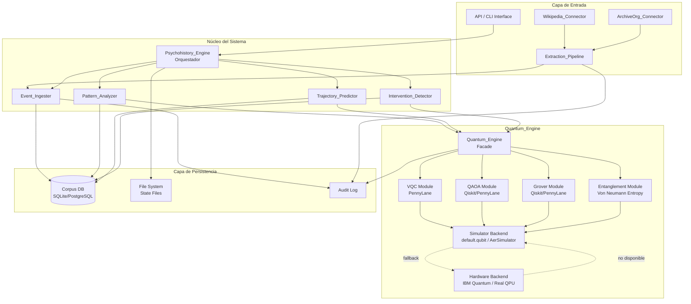
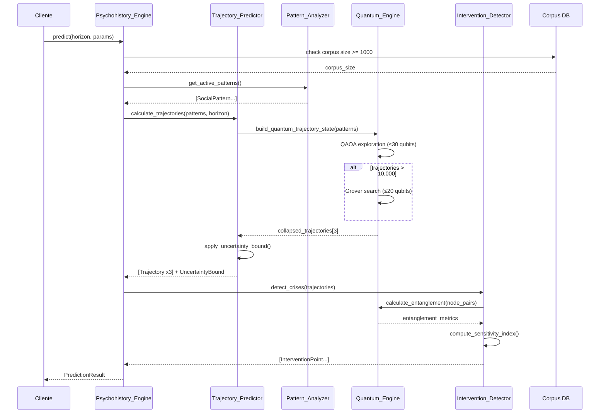
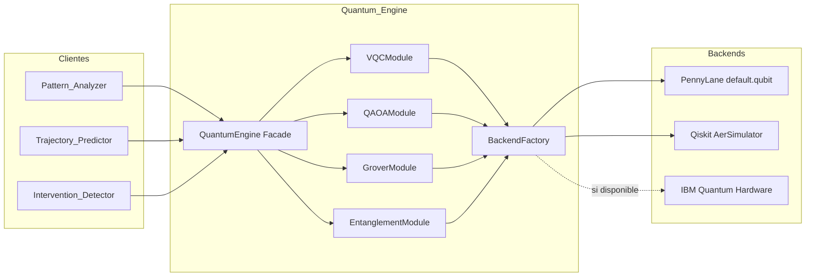
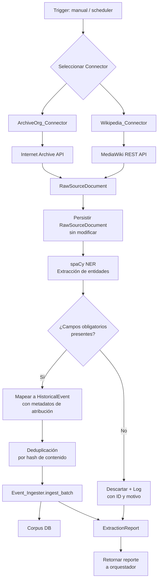

# Diseño Técnico: Psychohistory Engine


## Visión General

El **Psychohistory Engine** es un framework computacional híbrido que combina análisis de datos históricos, inteligencia artificial y computación cuántica para modelar el comportamiento de grandes poblaciones a lo largo del tiempo. El sistema ingiere eventos históricos desde fuentes heterogéneas (incluyendo Wikipedia y Archive.org), detecta patrones sociales mediante algoritmos clásicos y cuánticos, predice trayectorias probabilísticas de eventos futuros y detecta puntos de intervención críticos (Crisis Seldon).

### Principios de Diseño

1. **Separación de responsabilidades**: Cada subsistema tiene una responsabilidad única y bien definida. El `Quantum_Engine` es el único componente que conoce los detalles de implementación cuántica.
2. **Fallback gracioso**: Cuando el hardware cuántico no está disponible, el sistema degrada a simulación clásica sin interrumpir el flujo de trabajo.
3. **Determinismo reproducible**: Para el mismo estado del Corpus y los mismos parámetros, el sistema produce resultados idénticos (usando semillas aleatorias fijas en el simulador).
4. **Trazabilidad completa**: Cada predicción, patrón y punto de intervención mantiene una cadena de evidencia hasta los eventos históricos fuente.
5. **Límite de incertidumbre fundamental**: El sistema reconoce y comunica el `Uncertainty_Bound` como restricción irreducible, análoga al principio de incertidumbre de Heisenberg.

### Decisiones Tecnológicas Clave

| Componente | Tecnología elegida | Justificación |
|---|---|---|
| Lenguaje principal | Python 3.11+ | Ecosistema maduro para ML, computación cuántica y análisis de datos |
| Backend cuántico primario | **PennyLane 0.38+** | Diferenciación automática nativa, ideal para VQC/QML; mejor rendimiento en ejecución que Qiskit para entrenamiento variacional |
| Backend cuántico secundario | **Qiskit 1.x** (via plugin PennyLane) | Acceso a hardware IBM Quantum; QAOA y Grover bien documentados |
| Simulador cuántico | `pennylane.default.qubit` / `qiskit_aer` | Simulación local sin dependencias de nube |
| Grafos de causalidad | **NetworkX 3.x** | Biblioteca estándar para grafos dirigidos en Python; soporte nativo para análisis de centralidad y caminos |
| Persistencia | **SQLite** (desarrollo) / **PostgreSQL** (producción) | SQLite para prototipado sin infraestructura; PostgreSQL para escala con soporte JSON nativo |
| Serialización de estado | **MessagePack** + **JSON** | MessagePack para eficiencia binaria; JSON para portabilidad y legibilidad humana |
| Extracción Wikipedia | `wikipedia-api` (PyPI) + MediaWiki REST API | Wrapper maduro con soporte para secciones, categorías y búsqueda |
| Extracción Archive.org | `internetarchive` (PyPI) | Biblioteca oficial de Internet Archive |
| NLP para extracción | **spaCy 3.x** | Reconocimiento de entidades nombradas (fechas, lugares, personas) para mapeo a `Historical_Event` |
| Testing | **pytest** + **Hypothesis** | Hypothesis para property-based testing en Python |
| Hashing de integridad | **SHA-256** (hashlib) | Estándar para verificación de integridad de archivos de estado |


---

## Arquitectura

### Diagrama de Componentes de Alto Nivel



### Diagrama de Flujo de Predicción




---

## Componentes e Interfaces

### Psychohistory_Engine (Orquestador)

Punto de entrada único del sistema. Expone la API pública y coordina los subsistemas.

```python
class PsychohistoryEngine:
    def ingest_events(self, events: list[dict], format: str) -> IngestionReport
    def predict(self, horizon_years: int, params: PredictionParams) -> PredictionResult
    def query_corpus(self, filters: CorpusQuery) -> list[HistoricalEvent]
    def export_state(self, path: str) -> StateFile
    def import_state(self, path: str) -> None
    def get_explanation(self, trajectory_id: str) -> ExplanabilityReport
    def configure_connector(self, connector_id: str, config: ConnectorConfig) -> None
    def trigger_extraction(self, connector_id: str) -> ExtractionReport
```

### Event_Ingester

Responsable de validar, normalizar y persistir `Historical_Events`.

```python
class EventIngester:
    def ingest(self, raw: dict | str, format: Literal["json","csv","text"]) -> IngestionResult
    def ingest_batch(self, source: Iterable, format: str) -> BatchIngestionReport
    def _normalize(self, raw: dict) -> HistoricalEvent
    def _validate(self, event: HistoricalEvent) -> ValidationResult
```

**Reglas de validación**: Los campos `date` y `description` son obligatorios. Si alguno falta, se rechaza el evento con un mensaje que identifica los campos ausentes.

### Pattern_Analyzer

Detecta correlaciones estadísticas y construye grafos de causalidad.

```python
class PatternAnalyzer:
    def analyze(self, corpus: CorpusSnapshot) -> list[SocialPattern]
    def recalculate_affected(self, new_events: list[HistoricalEvent]) -> list[SocialPattern]
    def _classical_correlation(self, events: list[HistoricalEvent]) -> list[SocialPattern]
    def _quantum_correlation(self, feature_matrix: np.ndarray) -> list[SocialPattern]
    def _build_causality_graph(self, pattern: SocialPattern) -> nx.DiGraph
```

**Umbral de delegación cuántica**: Cuando la dimensionalidad del espacio de características supera 50, se delega al `Quantum_Engine` mediante VQC.

### Trajectory_Predictor

Calcula trayectorias probabilísticas y aplica el principio de incertidumbre.

```python
class TrajectoryPredictor:
    def predict(self, patterns: list[SocialPattern], horizon: int, seed: int) -> list[Trajectory]
    def _apply_uncertainty_bound(self, trajectory: Trajectory) -> Trajectory
    def _invalidate_stale(self, updated_patterns: list[SocialPattern]) -> None
    def _compute_confidence_score(self, trajectory: Trajectory) -> float
```

### Intervention_Detector

Identifica Crisis Seldon y calcula el impacto diferencial de intervenciones.

```python
class InterventionDetector:
    def detect(self, trajectory: Trajectory) -> list[InterventionPoint]
    def _compute_sensitivity_index(self, node: TrajectoryNode, trajectory: Trajectory) -> float
    def _compute_differential_impact(self, point: InterventionPoint, trajectory: Trajectory) -> float
```

### Quantum_Engine (Facade)

Interfaz unificada para todas las operaciones cuánticas. Los subsistemas no conocen el backend subyacente.

```python
class QuantumEngine:
    def train_vqc(self, feature_matrix: np.ndarray, n_qubits: int, seed: int) -> VQCResult
    def run_qaoa(self, cost_operator: SparsePauliOp, n_qubits: int, p_layers: int) -> QAOAResult
    def run_grover(self, oracle: QuantumCircuit, n_qubits: int, iterations: int) -> GroverResult
    def von_neumann_entropy(self, state_vector: np.ndarray, subsystem_qubits: list[int]) -> float
    def _get_backend(self) -> Backend  # hardware o simulador
    def _log_execution(self, circuit_type: str, n_qubits: int, iterations: int, ms: float) -> None
```

**Política de fallback**: Si el hardware cuántico no responde en 10 segundos, se conmuta automáticamente al simulador y se registra en el log.

### Data_Connectors

```python
class DataConnector(ABC):
    def search(self, query: SearchQuery) -> list[RawSourceDocument]
    def fetch(self, identifier: str) -> RawSourceDocument
    def _handle_rate_limit(self, retry_after: int) -> None
    def _handle_timeout(self) -> None

class WikipediaConnector(DataConnector):
    # Usa wikipedia-api (PyPI) + MediaWiki REST API
    # Endpoint: https://en.wikipedia.org/w/api.php
    def search(self, query: SearchQuery) -> list[RawSourceDocument]

class ArchiveOrgConnector(DataConnector):
    # Usa internetarchive (PyPI)
    # Endpoint: https://archive.org/advancedsearch.php
    def search(self, query: SearchQuery) -> list[RawSourceDocument]
```

### Extraction_Pipeline

Orquesta el flujo desde `RawSourceDocument` hasta `HistoricalEvent`.

```python
class ExtractionPipeline:
    def run(self, connector: DataConnector, query: SearchQuery) -> ExtractionReport
    def _transform(self, doc: RawSourceDocument) -> list[HistoricalEvent]
    def _extract_entities(self, text: str) -> EntityExtractionResult  # spaCy NER
    def _deduplicate(self, events: list[HistoricalEvent]) -> list[HistoricalEvent]
    def _schedule(self, connector_id: str, frequency_hours: int) -> None
```


---

## Modelos de Datos

### HistoricalEvent

Unidad atómica del Corpus. Representa un suceso histórico normalizado.

```python
@dataclass
class HistoricalEvent:
    id: str                          # UUID v4, asignado en ingesta
    date: datetime                   # Fecha del evento (obligatorio)
    description: str                 # Descripción textual (obligatorio)
    location: Location | None        # Lugar del evento
    actors: list[str]                # Actores involucrados
    magnitude: float | None          # Escala de impacto [0.0, 1.0]
    category: EventCategory          # Enum: POLITICAL, ECONOMIC, SOCIAL, MILITARY, CULTURAL, NATURAL
    source_url: str | None           # URL canónica del documento fuente
    connector_name: str | None       # Nombre del Data_Connector que lo extrajo
    extraction_timestamp: datetime | None  # Marca de tiempo de extracción
    raw_document_id: str | None      # ID del RawSourceDocument de origen
    feature_vector: np.ndarray | None  # Vector de características para QML (calculado en análisis)

@dataclass
class Location:
    name: str
    latitude: float | None
    longitude: float | None
    region: str | None
    country: str | None
```

### SocialPattern

Correlación estadísticamente significativa entre categorías de eventos.

```python
@dataclass
class SocialPattern:
    id: str                          # UUID v4
    name: str                        # Nombre descriptivo del patrón
    confidence_score: float          # [0.0, 1.0]
    recurrence_period_years: float | None  # Período de recurrencia [1, 500]
    causality_graph: nx.DiGraph      # Grafo dirigido de causalidad entre categorías
    supporting_events: list[str]     # IDs de HistoricalEvents que sustentan el patrón
    is_quantum_detected: bool        # True si fue detectado por el Quantum_Engine
    qubits_used: int | None          # Número de qubits del circuito VQC (si aplica)
    created_at: datetime
    updated_at: datetime
```

### Trajectory

Secuencia ordenada de eventos futuros probables.

```python
@dataclass
class TrajectoryNode:
    sequence_index: int
    predicted_event: PredictedEvent
    probability: float               # Probabilidad individual del evento
    supporting_patterns: list[str]   # IDs de SocialPatterns que fundamentan este nodo
    entanglement_correlations: list[EntanglementCorrelation]  # Nodos con Entanglement_Metric > 0.6

@dataclass
class PredictedEvent:
    description: str
    estimated_date: datetime
    category: EventCategory
    location_hint: str | None

@dataclass
class EntanglementCorrelation:
    node_index: int                  # Índice del nodo correlacionado
    entanglement_metric: float       # Entropía de Von Neumann [0.0, 1.0]

@dataclass
class UncertaintyBound:
    sigma_state: float               # Incertidumbre en Social_State
    sigma_momentum: float            # Incertidumbre en Social_Momentum
    product: float                   # sigma_state * sigma_momentum
    h_social: float                  # Constante mínima del sistema (default: 0.01)
    was_adjusted: bool               # True si fue ajustado para satisfacer la restricción
    adjustment_reason: str | None    # Descripción del ajuste aplicado

@dataclass
class Trajectory:
    id: str                          # UUID v4
    nodes: list[TrajectoryNode]
    confidence_score: float          # Producto de probabilidades individuales
    horizon_years: int
    uncertainty_bound: UncertaintyBound
    reasoning_trace: ReasoningTrace
    created_at: datetime
    corpus_snapshot_hash: str        # Hash del estado del Corpus en el momento de cálculo
    seed: int                        # Semilla aleatoria para reproducibilidad
```

### InterventionPoint (Seldon_Crisis)

```python
@dataclass
class InterventionPoint:
    id: str                          # UUID v4
    trajectory_id: str
    node_index: int                  # Índice del nodo en la Trajectory
    temporal_coordinates: datetime   # Coordenada temporal de la crisis
    relevant_actor_categories: list[str]
    recommended_action_type: str
    sensitivity_index: float         # [0.0, 1.0]; umbral de crisis: > 0.7
    entangled_nodes: list[EntanglementCorrelation]  # Nodos con Entanglement_Metric > 0.6
    supporting_patterns: list[str]   # IDs de SocialPatterns que elevan el Sensitivity_Index
    differential_impact: float       # Divergencia entre Trajectory original y post-intervención
```

### RawSourceDocument

```python
@dataclass
class RawSourceDocument:
    id: str                          # UUID v4
    source_url: str
    connector_name: str
    raw_content: str                 # Contenido original sin modificar
    content_type: str                # "text/html", "text/plain", "application/json"
    extraction_timestamp: datetime
    metadata: dict                   # Metadatos adicionales de la fuente
```

### SystemState (para serialización)

```python
@dataclass
class SystemState:
    version: str                     # Versión del esquema de serialización
    created_at: datetime
    corpus: list[HistoricalEvent]
    patterns: list[SocialPattern]
    active_trajectories: list[Trajectory]
    connector_configs: list[ConnectorConfig]
    integrity_hash: str              # SHA-256 del contenido serializado (excluye este campo)
```

### ReasoningTrace

```python
@dataclass
class ReasoningTrace:
    trajectory_id: str
    steps: list[ReasoningStep]
    uncertainty_adjustments: list[str]  # Registro de ajustes de Uncertainty_Bound

@dataclass
class ReasoningStep:
    node_index: int
    predicted_event_description: str
    pattern_ids: list[str]           # Patrones que fundamentan este paso
    event_ids: list[str]             # Eventos históricos que sustentan los patrones
    confidence_contribution: float
```


---

## Diseño del Quantum_Engine

### Arquitectura Interna

El `Quantum_Engine` implementa el patrón **Facade** sobre PennyLane (backend primario) y Qiskit (backend secundario). Los subsistemas clientes nunca importan PennyLane ni Qiskit directamente.



### Módulo VQC (Variational Quantum Circuit)

**Propósito**: Detectar correlaciones en espacios de características de alta dimensionalidad (>50 dimensiones) para identificar `Social_Patterns`.

**Implementación con PennyLane**:

```python
import pennylane as qml
import numpy as np

def build_vqc(n_qubits: int, n_layers: int, seed: int):
    """
    Construye un VQC con codificación de ángulo y capas variacionales.
    Arquitectura: AngleEmbedding → StronglyEntanglingLayers → medición
    """
    dev = qml.device("default.qubit", wires=n_qubits, seed=seed)

    @qml.qnode(dev, diff_method="backprop")
    def circuit(inputs: np.ndarray, weights: np.ndarray) -> np.ndarray:
        qml.AngleEmbedding(inputs, wires=range(n_qubits), rotation="Y")
        qml.StronglyEntanglingLayers(weights, wires=range(n_qubits))
        return [qml.expval(qml.PauliZ(i)) for i in range(n_qubits)]

    weight_shape = qml.StronglyEntanglingLayers.shape(n_layers=n_layers, n_wires=n_qubits)
    rng = np.random.default_rng(seed)
    initial_weights = rng.uniform(-np.pi, np.pi, weight_shape)
    return circuit, initial_weights
```

**Límites**: Hasta 50 qubits. El número de qubits se determina como `min(n_features // 2, 50)`.

**Entrenamiento**: Optimizador Adam con diferenciación automática de PennyLane. El `Pattern_Analyzer` proporciona la matriz de características normalizada y las etiquetas de categoría como supervisión débil.

### Módulo QAOA

**Propósito**: Explorar el espacio de `Trajectories` posibles modelado como un problema de optimización combinatoria. Cada `Trajectory` candidata se codifica como una asignación binaria de eventos.

**Formulación**: El espacio de trayectorias se mapea a un problema de Max-Cut sobre el grafo de causalidad de `Social_Patterns`. Las trayectorias de mayor probabilidad corresponden a los cortes de mayor peso.

```python
from qiskit_algorithms import QAOA
from qiskit_algorithms.optimizers import COBYLA
from qiskit.primitives import Sampler

def run_qaoa(cost_operator: SparsePauliOp, n_qubits: int, p_layers: int = 3, seed: int = 42):
    """
    Ejecuta QAOA para encontrar las configuraciones de mayor probabilidad.
    p_layers: profundidad del circuito QAOA (mayor p → mejor aproximación)
    """
    sampler = Sampler()
    optimizer = COBYLA(maxiter=300, seed=seed)
    qaoa = QAOA(sampler=sampler, optimizer=optimizer, reps=p_layers)
    result = qaoa.compute_minimum_eigenvalue(cost_operator)
    return result
```

**Límites**: Hasta 30 qubits. Codifica hasta 2^30 ≈ 10^9 trayectorias candidatas.

### Módulo Grover

**Propósito**: Cuando el espacio de trayectorias supera 10,000 combinaciones, Grover proporciona ventaja cuadrática (O(√N) vs O(N)) para identificar las trayectorias óptimas.

**Implementación**: El oráculo de Grover marca los estados cuánticos que corresponden a trayectorias con `Confidence_Score` superior al umbral definido por QAOA.

```python
from qiskit.circuit.library import GroverOperator
from qiskit_algorithms import Grover, AmplificationProblem

def run_grover(oracle: QuantumCircuit, n_qubits: int, iterations: int, seed: int):
    """
    Aplica amplificación de amplitud para identificar trayectorias óptimas.
    iterations: número de iteraciones de Grover ≈ π/4 * √(N/M)
    donde N = espacio de búsqueda, M = número de soluciones
    """
    problem = AmplificationProblem(oracle=oracle, is_good_state=oracle.num_qubits * ["1"])
    grover = Grover(iterations=iterations, seed_simulator=seed)
    result = grover.amplify(problem)
    return result
```

**Límites**: Hasta 20 qubits (espacio de búsqueda de hasta 2^20 ≈ 10^6 trayectorias).

### Módulo de Entrelazamiento (Entropía de Von Neumann)

**Propósito**: Calcular la `Entanglement_Metric` entre pares de nodos de una `Trajectory` como la entropía de Von Neumann del estado cuántico reducido.

**Definición matemática**:

Para un estado bipartito |ψ⟩_AB, la entropía de Von Neumann del subsistema A es:

```
S(ρ_A) = -Tr(ρ_A · log₂(ρ_A))
```

donde `ρ_A = Tr_B(|ψ⟩⟨ψ|)` es la matriz de densidad reducida del subsistema A.

El valor está en [0, log₂(d)] donde d es la dimensión del subsistema. Se normaliza a [0.0, 1.0] dividiendo por log₂(d).

```python
import pennylane as qml
import numpy as np

def von_neumann_entropy(state_vector: np.ndarray, subsystem_qubits: list[int], total_qubits: int) -> float:
    """
    Calcula la entropía de Von Neumann normalizada del subsistema especificado.
    Retorna un valor en [0.0, 1.0].
    """
    # Construir la matriz de densidad del estado puro
    rho = np.outer(state_vector, state_vector.conj())
    # Traza parcial sobre el complemento del subsistema
    rho_reduced = partial_trace(rho, subsystem_qubits, total_qubits)
    # Calcular eigenvalores
    eigenvalues = np.linalg.eigvalsh(rho_reduced)
    eigenvalues = eigenvalues[eigenvalues > 1e-12]  # Filtrar valores numéricos cero
    # Entropía de Von Neumann
    entropy = -np.sum(eigenvalues * np.log2(eigenvalues))
    # Normalizar al rango [0, 1]
    max_entropy = np.log2(2 ** len(subsystem_qubits))
    return float(np.clip(entropy / max_entropy, 0.0, 1.0))
```

### Política de Fallback y Logging

```python
class BackendFactory:
    def get_backend(self, n_qubits: int) -> Backend:
        if self._hardware_available() and n_qubits <= self._hardware_max_qubits():
            return self._hardware_backend
        else:
            self._log("SIMULATED", n_qubits)
            return self._simulator_backend

    def _hardware_available(self) -> bool:
        # Intenta conexión con timeout de 10 segundos
        try:
            return self._hardware_backend.status().operational
        except Exception:
            return False
```

Cada ejecución de circuito registra en el log:
- `circuit_type`: "VQC" | "QAOA" | "GROVER" | "ENTANGLEMENT"
- `n_qubits`: número de qubits utilizados
- `iterations`: número de iteraciones del optimizador
- `execution_ms`: tiempo de ejecución en milisegundos
- `backend`: "hardware" | "simulator"
- `seed`: semilla aleatoria utilizada


---

## Pipeline de Extracción

### Flujo Completo



### Wikipedia_Connector

**API utilizada**: MediaWiki REST API (`https://en.wikipedia.org/w/api.php`) + biblioteca `wikipedia-api` (PyPI).

**Modos de búsqueda**:
1. **Por título**: `action=query&titles={title}&prop=revisions&rvprop=content`
2. **Por categoría**: `action=query&list=categorymembers&cmtitle=Category:{name}`
3. **Búsqueda de texto libre**: `action=query&list=search&srsearch={query}`

**Manejo de rate limiting**: La API de Wikipedia devuelve HTTP 429 con cabecera `Retry-After`. El conector pausa exactamente el número de segundos indicado y reanuda automáticamente.

**Manejo de timeout**: Si no hay respuesta en 30 segundos, se registra el fallo con timestamp y número de reintentos, y se retorna error sin interrumpir otras extracciones.

```python
class WikipediaConnector(DataConnector):
    BASE_URL = "https://en.wikipedia.org/w/api.php"
    TIMEOUT_SECONDS = 30

    def search(self, query: SearchQuery) -> list[RawSourceDocument]:
        params = self._build_params(query)
        response = self._request_with_retry(params)
        return [self._to_raw_doc(page) for page in response["query"]["pages"].values()]

    def _request_with_retry(self, params: dict, attempt: int = 0) -> dict:
        try:
            resp = requests.get(self.BASE_URL, params=params, timeout=self.TIMEOUT_SECONDS)
            if resp.status_code == 429:
                retry_after = int(resp.headers.get("Retry-After", 60))
                time.sleep(retry_after)
                return self._request_with_retry(params, attempt)
            resp.raise_for_status()
            return resp.json()
        except requests.Timeout:
            self._log_timeout(attempt)
            raise ConnectorTimeoutError(f"Wikipedia no respondió en {self.TIMEOUT_SECONDS}s")
```

### ArchiveOrg_Connector

**API utilizada**: `internetarchive` (PyPI) — biblioteca oficial de Internet Archive.

**Modos de búsqueda**:
1. **Por colección**: `ia.search_items(f"collection:{collection}")`
2. **Por rango de fechas**: `ia.search_items(f"date:[{start} TO {end}]")`
3. **Búsqueda de texto libre**: `ia.search_items(query)`

```python
import internetarchive as ia

class ArchiveOrgConnector(DataConnector):
    def search(self, query: SearchQuery) -> list[RawSourceDocument]:
        ia_query = self._build_ia_query(query)
        results = ia.search_items(ia_query, fields=["identifier", "title", "date", "description"])
        return [self._to_raw_doc(item) for item in results]
```

### Transformación NLP (spaCy)

El `Extraction_Pipeline` usa spaCy para extraer entidades nombradas del texto crudo y mapearlas al esquema canónico de `HistoricalEvent`:

| Entidad spaCy | Campo HistoricalEvent |
|---|---|
| `DATE`, `TIME` | `date` |
| `GPE`, `LOC` | `location` |
| `PERSON`, `ORG`, `NORP` | `actors` |
| Texto completo | `description` |

**Modelo recomendado**: `en_core_web_trf` (transformer-based) para mayor precisión en textos históricos.

### Deduplicación

Para evitar duplicar `Historical_Events` en extracciones periódicas, el pipeline:
1. Calcula un hash SHA-256 del par `(date, description)` normalizado.
2. Verifica si el hash ya existe en el Corpus antes de insertar.
3. En extracciones incrementales, filtra documentos cuya `publication_date` sea anterior a la última extracción exitosa del mismo conector.

### Scheduler de Extracciones Periódicas

```python
class ExtractionScheduler:
    MIN_FREQUENCY_HOURS = 1
    MAX_FREQUENCY_HOURS = 8760  # 1 año

    def schedule(self, connector_id: str, frequency_hours: int) -> None:
        if not (self.MIN_FREQUENCY_HOURS <= frequency_hours <= self.MAX_FREQUENCY_HOURS):
            raise ValueError(f"frequency_hours debe estar en [{self.MIN_FREQUENCY_HOURS}, {self.MAX_FREQUENCY_HOURS}]")
        # Registra la tarea en el scheduler (APScheduler o similar)
        self._scheduler.add_job(
            func=self._run_extraction,
            trigger="interval",
            hours=frequency_hours,
            id=connector_id,
            replace_existing=True
        )
```


---

## Algoritmos Clave

### Cálculo del Sensitivity_Index

El `Sensitivity_Index` de un nodo combina dos componentes:

```
SI(nodo) = α · D(nodo) + (1 - α) · E(nodo)
```

Donde:
- `D(nodo)` = divergencia promedio entre trayectorias alternativas al perturbar el nodo ±10%
- `E(nodo)` = `Entanglement_Metric` promedio entre el nodo y los demás nodos de la trayectoria
- `α = 0.6` (peso de la divergencia sobre el entrelazamiento; configurable)

**Cálculo de D(nodo)**:
1. Generar N=10 perturbaciones del nodo con variaciones aleatorias en el rango [-10%, +10%] de sus parámetros.
2. Para cada perturbación, recalcular la trayectoria desde ese nodo.
3. Calcular la distancia promedio entre la trayectoria original y las perturbadas usando distancia de Wasserstein sobre las distribuciones de probabilidad.

### Cálculo del Uncertainty_Bound

```python
def compute_uncertainty_bound(
    sigma_state: float,
    sigma_momentum: float,
    h_social: float = 0.01,
    horizon_years: int = 1
) -> UncertaintyBound:
    """
    Calcula el Uncertainty_Bound y ajusta si viola la restricción.
    Para horizontes > 100 años, escala proporcionalmente.
    """
    # Escalar por horizonte temporal
    if horizon_years > 100:
        scale_factor = 1.0 + (horizon_years - 100) / 100.0
        sigma_state *= scale_factor
        sigma_momentum *= scale_factor

    product = sigma_state * sigma_momentum
    was_adjusted = False

    if product < h_social:
        # Ajuste proporcional: escalar ambas incertidumbres por sqrt(h_social / product)
        adjustment = np.sqrt(h_social / product)
        sigma_state *= adjustment
        sigma_momentum *= adjustment
        product = sigma_state * sigma_momentum
        was_adjusted = True

    return UncertaintyBound(
        sigma_state=sigma_state,
        sigma_momentum=sigma_momentum,
        product=product,
        h_social=h_social,
        was_adjusted=was_adjusted,
        adjustment_reason="Ajuste proporcional para satisfacer σ_estado × σ_momentum ≥ ħ_social" if was_adjusted else None
    )
```

### Cálculo del Confidence_Score de Trajectory

```python
def compute_trajectory_confidence(nodes: list[TrajectoryNode]) -> float:
    """
    El Confidence_Score global es el producto de las probabilidades individuales.
    Para evitar underflow numérico, se calcula en espacio logarítmico.
    """
    log_confidence = sum(np.log(node.probability) for node in nodes if node.probability > 0)
    return float(np.exp(log_confidence))
```

### Invalidación de Trayectorias

Cuando el Corpus se actualiza, se invalidan las trayectorias cuyo `Confidence_Score` haya variado más de 0.05:

```python
def invalidate_stale_trajectories(
    trajectories: list[Trajectory],
    updated_patterns: list[SocialPattern]
) -> list[Trajectory]:
    stale = []
    for traj in trajectories:
        new_score = recompute_confidence(traj, updated_patterns)
        if abs(new_score - traj.confidence_score) > 0.05:
            stale.append(traj)
    return stale
```

### Serialización del Estado del Sistema

```python
import hashlib
import msgpack

def export_state(engine_state: SystemState, path: str) -> None:
    """
    Serializa el estado completo a MessagePack con hash de integridad SHA-256.
    """
    # Serializar sin el campo integrity_hash
    state_dict = engine_state.to_dict()
    state_dict.pop("integrity_hash", None)
    serialized = msgpack.packb(state_dict, use_bin_type=True)
    # Calcular hash
    integrity_hash = hashlib.sha256(serialized).hexdigest()
    # Añadir hash y re-serializar
    state_dict["integrity_hash"] = integrity_hash
    final = msgpack.packb(state_dict, use_bin_type=True)
    with open(path, "wb") as f:
        f.write(final)

def import_state(path: str) -> SystemState:
    """
    Deserializa y verifica la integridad del archivo de estado.
    """
    with open(path, "rb") as f:
        data = msgpack.unpackb(f.read(), raw=False)
    stored_hash = data.pop("integrity_hash")
    # Recalcular hash del contenido sin el campo integrity_hash
    recalculated = hashlib.sha256(msgpack.packb(data, use_bin_type=True)).hexdigest()
    if stored_hash != recalculated:
        raise StateIntegrityError("El archivo de estado está corrupto o ha sido alterado")
    return SystemState.from_dict(data)
```


---

## Propiedades de Corrección

*Una propiedad es una característica o comportamiento que debe ser verdadero en todas las ejecuciones válidas de un sistema — esencialmente, una declaración formal sobre lo que el sistema debe hacer. Las propiedades sirven como puente entre las especificaciones legibles por humanos y las garantías de corrección verificables por máquinas.*

Las propiedades a continuación se derivan del análisis de los criterios de aceptación y están diseñadas para ser implementadas con **Hypothesis** (biblioteca de property-based testing para Python). Cada test debe ejecutarse con un mínimo de 100 iteraciones.

---

### Propiedad 1: Normalización preserva el esquema canónico

*Para cualquier* evento histórico válido recibido en cualquier formato soportado (JSON, CSV, texto plano), la normalización debe producir un `HistoricalEvent` con todos los campos del esquema canónico correctamente tipados y con `date` y `description` no nulos.

**Valida: Requisito 1.2**

---

### Propiedad 2: Rechazo de eventos con campos obligatorios ausentes

*Para cualquier* evento histórico en el que al menos uno de los campos obligatorios (`date` o `description`) esté ausente, el `Event_Ingester` debe rechazarlo y el mensaje de error debe identificar explícitamente cada campo faltante.

**Valida: Requisito 1.3**

---

### Propiedad 3: Ingesta produce IDs únicos y persistencia verificable

*Para cualquier* lote de N eventos históricos válidos (N ≥ 1), después de la ingesta exitosa: (a) todos los eventos tienen IDs distintos entre sí, y (b) cada evento es recuperable del Corpus por su ID.

**Valida: Requisito 1.4**

---

### Propiedad 4: Consistencia del reporte de ingesta por lotes

*Para cualquier* lote que contenga N_valid eventos válidos y N_invalid eventos inválidos, el reporte de ingesta debe satisfacer: `report.accepted == N_valid` y `report.rejected == N_invalid` y `report.accepted + report.rejected == N_valid + N_invalid`.

**Valida: Requisito 1.6**

---

### Propiedad 5: Confidence_Score de patrón está en rango válido

*Para cualquier* `Social_Pattern` detectado por el `Pattern_Analyzer`, su `Confidence_Score` debe estar en el intervalo cerrado [0.0, 1.0].

**Valida: Requisito 2.2**

---

### Propiedad 6: Patrones con Confidence_Score bajo son descartados

*Para cualquier* patrón candidato cuyo `Confidence_Score` sea estrictamente menor que 0.3, el patrón no debe aparecer en la lista de patrones activos del sistema.

**Valida: Requisito 2.3**

---

### Propiedad 7: Actualización del Corpus preserva patrones no relacionados

*Para cualquier* estado del Corpus con patrones en categorías disjuntas C1 y C2, al añadir nuevos eventos de categoría C1, los patrones de categoría C2 deben permanecer inalterados (mismo ID, mismo `Confidence_Score`, mismo grafo de causalidad).

**Valida: Requisito 2.5**

---

### Propiedad 8: Delegación cuántica por dimensionalidad

*Para cualquier* matriz de características con más de 50 columnas, el `Pattern_Analyzer` debe delegar la detección al `Quantum_Engine` (verificable mediante mock). Para matrices con 50 o menos columnas, no debe delegarse.

**Valida: Requisito 2.7**

---

### Propiedad 9: Predicción retorna exactamente tres trayectorias

*Para cualquier* corpus válido (≥ 1,000 eventos) y horizonte temporal en [1, 1000] años, el `Trajectory_Predictor` debe retornar exactamente 3 trayectorias.

**Valida: Requisito 3.1**

---

### Propiedad 10: Confidence_Score de trayectoria es el producto de probabilidades individuales

*Para cualquier* `Trajectory` generada, su `confidence_score` debe ser igual (con tolerancia numérica de 1e-9) al producto de las probabilidades individuales de todos sus nodos: `confidence_score ≈ ∏(node.probability for node in nodes)`.

**Valida: Requisito 3.2**

---

### Propiedad 11: Determinismo de predicciones con la misma semilla

*Para cualquier* estado del Corpus y parámetros de predicción, ejecutar `predict()` dos veces con la misma semilla aleatoria debe producir trayectorias idénticas (mismos nodos, mismos `Confidence_Scores`, mismo `Uncertainty_Bound`).

**Valida: Requisitos 3.7, 5.9**

---

### Propiedad 12: Corrección del Sensitivity_Index y clasificación de Crisis Seldon

*Para cualquier* nodo de una trayectoria con divergencia D y `Entanglement_Metric` promedio E, el `Sensitivity_Index` calculado debe satisfacer `SI = 0.6 * D + 0.4 * E`, y el nodo debe ser clasificado como `Seldon_Crisis` si y solo si `SI > 0.7`.

**Valida: Requisitos 4.2, 4.3**

---

### Propiedad 13: Entanglement_Metric está en rango válido

*Para cualquier* par de nodos de una trayectoria, la `Entanglement_Metric` calculada por el `Quantum_Engine` mediante entropía de Von Neumann debe estar en el intervalo cerrado [0.0, 1.0].

**Valida: Requisito 4.4**

---

### Propiedad 14: Intervention_Points ordenados por Sensitivity_Index descendente

*Para cualquier* trayectoria con múltiples `Intervention_Points`, la lista retornada por el `Intervention_Detector` debe estar ordenada de mayor a menor `Sensitivity_Index`: `points[i].sensitivity_index >= points[i+1].sensitivity_index` para todo i.

**Valida: Requisito 4.7**

---

### Propiedad 15: Invariante del Uncertainty_Bound

*Para cualquier* predicción generada por el sistema, el `Uncertainty_Bound` debe satisfacer la invariante `uncertainty_bound.product >= h_social` (donde `h_social = 0.01` por defecto). Esta propiedad debe mantenerse tanto antes como después de cualquier ajuste proporcional.

**Valida: Requisitos 6.1, 6.2, 6.3**

---

### Propiedad 16: Monotonía del Uncertainty_Bound con el horizonte temporal

*Para cualquier* par de horizontes temporales h1 > h2 > 100 años con los mismos parámetros de estado social, el `Uncertainty_Bound` calculado para h1 debe ser estrictamente mayor que el calculado para h2: `UB(h1) > UB(h2)`.

**Valida: Requisito 6.7**

---

### Propiedad 17: Corrección de filtros en consultas del Corpus

*Para cualquier* consulta con combinación de filtros (rango de fechas, categoría, lugar, actores) conectados por operadores AND u OR, todos los `Historical_Events` retornados deben satisfacer la expresión lógica completa de los filtros aplicados.

**Valida: Requisito 7.4**

---

### Propiedad 18: Round-trip de serialización del estado del sistema

*Para cualquier* estado válido del sistema (con corpus, patrones y trayectorias arbitrarios), serializar el estado a archivo y luego deserializarlo debe producir un sistema funcionalmente equivalente: mismo número de eventos, mismos IDs, mismos patrones y mismas trayectorias activas.

**Valida: Requisito 8.3**

---

### Propiedad 19: Integridad del archivo de estado exportado

*Para cualquier* estado del sistema exportado, el campo `integrity_hash` del archivo debe ser igual al SHA-256 del contenido serializado (excluyendo el propio campo `integrity_hash`). Cualquier modificación de un byte en el contenido debe invalidar el hash.

**Valida: Requisito 8.5**

---

### Propiedad 20: Completitud de la traza de razonamiento

*Para cualquier* trayectoria generada, cada nodo de la trayectoria debe tener al menos un `Social_Pattern` de soporte en `supporting_patterns`, y cada patrón referenciado debe existir en el Corpus activo.

**Valida: Requisito 9.1**

---

### Propiedad 21: Preservación del documento fuente en el pipeline

*Para cualquier* documento recuperado por un `Data_Connector`, el `RawSourceDocument` almacenado debe contener el `raw_content` idéntico al contenido original de la fuente (sin modificaciones).

**Valida: Requisito 10.3**

---

### Propiedad 22: Completitud de metadatos de atribución en el pipeline

*Para cualquier* `Historical_Event` generado por el `Extraction_Pipeline`, los campos `source_url`, `connector_name` y `extraction_timestamp` deben ser no nulos y el `source_url` debe ser una URL válida.

**Valida: Requisitos 10.4, 10.6**

---

### Propiedad 23: Deduplicación temporal en extracciones incrementales

*Para cualquier* extracción incremental con checkpoint en tiempo T, ningún `Historical_Event` cuya fecha de publicación sea anterior o igual a T debe ser ingerido en el Corpus.

**Valida: Requisito 10.11**


---

## Manejo de Errores

### Estrategia General

El sistema usa excepciones tipadas organizadas en una jerarquía clara. Todos los errores son logeados con nivel apropiado antes de propagarse.

```python
class PsychohistoryError(Exception): pass

# Ingesta
class ValidationError(PsychohistoryError):
    def __init__(self, missing_fields: list[str]): ...

class BatchIngestionError(PsychohistoryError): pass

# Predicción
class InsufficientDataError(PsychohistoryError):
    """Corpus con menos de 1,000 eventos."""

class InvalidHorizonError(PsychohistoryError):
    """Horizonte fuera del rango [1, 1000] años."""

# Quantum
class QuantumExecutionError(PsychohistoryError):
    def __init__(self, circuit_type: str, invalid_param: str, accepted_range: str): ...

# Conectores
class ConnectorTimeoutError(PsychohistoryError):
    def __init__(self, connector: str, timeout_seconds: int, attempts: int): ...

class ConnectorRateLimitError(PsychohistoryError):
    def __init__(self, retry_after: int): ...

# Serialización
class StateIntegrityError(PsychohistoryError):
    """Archivo de estado corrupto o alterado."""

class StateImportError(PsychohistoryError):
    """Formato de archivo inválido."""
```

### Tabla de Errores por Subsistema

| Subsistema | Condición de error | Excepción | Comportamiento |
|---|---|---|---|
| Event_Ingester | Campos obligatorios ausentes | `ValidationError` | Rechaza evento, continúa lote |
| Trajectory_Predictor | Corpus < 1,000 eventos | `InsufficientDataError` | Retorna error al cliente |
| Trajectory_Predictor | Horizonte fuera de [1, 1000] | `InvalidHorizonError` | Retorna error al cliente |
| Quantum_Engine | Parámetros fuera de rango | `QuantumExecutionError` | Rechaza solicitud, identifica parámetro |
| Quantum_Engine | Hardware no disponible | — (fallback silencioso) | Conmuta a simulador, registra en log |
| Data_Connector | HTTP 429 | `ConnectorRateLimitError` | Pausa y reintenta automáticamente |
| Data_Connector | Timeout 30s | `ConnectorTimeoutError` | Registra fallo, retorna error sin interrumpir otras extracciones |
| Extraction_Pipeline | Documento sin campos obligatorios | — (descarte silencioso) | Descarta, registra en log, continúa |
| SystemState | Hash de integridad inválido | `StateIntegrityError` | Rechaza importación, estado sin cambios |
| SystemState | Formato inválido | `StateImportError` | Rechaza importación, estado sin cambios |

### Política de Reintentos

- **Data_Connectors**: Reintento automático con backoff exponencial (1s, 2s, 4s, máximo 3 reintentos) para errores de red transitorios. Para HTTP 429, espera exactamente el valor de `Retry-After`.
- **Quantum_Engine**: Sin reintentos automáticos. Si el hardware falla, fallback inmediato al simulador.
- **Extraction_Pipeline**: Las extracciones fallidas se marcan como pendientes y se reintentarán en el siguiente ciclo programado.


---

## Estrategia de Testing

### Enfoque Dual

El sistema utiliza dos tipos complementarios de tests:

1. **Tests de ejemplo (pytest)**: Verifican comportamientos específicos, casos de borde y condiciones de error con entradas concretas.
2. **Tests de propiedades (Hypothesis)**: Verifican las 23 propiedades de corrección definidas arriba con entradas generadas aleatoriamente (mínimo 100 iteraciones por propiedad).

### Biblioteca de Property-Based Testing

**Hypothesis** (versión 6.x) es la elección para Python. Proporciona:
- Generadores de datos arbitrarios (`@given`, `st.builds`, `st.lists`, etc.)
- Reducción automática de contraejemplos (shrinking)
- Integración nativa con pytest
- Soporte para estrategias personalizadas (necesario para `HistoricalEvent`, `Trajectory`, etc.)

### Configuración de Hypothesis

```python
from hypothesis import given, settings, HealthCheck
from hypothesis import strategies as st

# Configuración global para el proyecto
settings.register_profile("ci", max_examples=100, suppress_health_check=[HealthCheck.too_slow])
settings.register_profile("dev", max_examples=50)
settings.load_profile("ci")
```

### Estrategias de Generación Personalizadas

```python
# Estrategia para HistoricalEvent válido
@st.composite
def historical_events(draw):
    return HistoricalEvent(
        id=str(uuid.uuid4()),
        date=draw(st.datetimes(min_value=datetime(1, 1, 1), max_value=datetime(2024, 12, 31))),
        description=draw(st.text(min_size=1, max_size=500)),
        location=draw(st.one_of(st.none(), locations())),
        actors=draw(st.lists(st.text(min_size=1, max_size=50), max_size=10)),
        magnitude=draw(st.one_of(st.none(), st.floats(min_value=0.0, max_value=1.0))),
        category=draw(st.sampled_from(EventCategory)),
    )

# Estrategia para corpus válido (≥ 1000 eventos)
@st.composite
def valid_corpus(draw):
    return draw(st.lists(historical_events(), min_size=1000, max_size=5000))
```

### Estructura de Tests por Propiedad

Cada propiedad de corrección se implementa como un test de Hypothesis con el tag correspondiente:

```python
# Ejemplo: Propiedad 11 - Determinismo
@given(corpus=valid_corpus(), horizon=st.integers(min_value=1, max_value=1000), seed=st.integers())
@settings(max_examples=100)
def test_prediction_determinism(corpus, horizon, seed):
    """
    Feature: psychohistory-engine, Property 11: Determinismo de predicciones con la misma semilla
    """
    engine = PsychohistoryEngine(seed=seed)
    engine.load_corpus(corpus)
    result1 = engine.predict(horizon_years=horizon, seed=seed)
    result2 = engine.predict(horizon_years=horizon, seed=seed)
    assert result1 == result2

# Ejemplo: Propiedad 15 - Invariante del Uncertainty_Bound
@given(
    sigma_state=st.floats(min_value=0.001, max_value=10.0),
    sigma_momentum=st.floats(min_value=0.001, max_value=10.0),
    horizon=st.integers(min_value=1, max_value=1000)
)
@settings(max_examples=100)
def test_uncertainty_bound_invariant(sigma_state, sigma_momentum, horizon):
    """
    Feature: psychohistory-engine, Property 15: Invariante del Uncertainty_Bound
    """
    H_SOCIAL = 0.01
    result = compute_uncertainty_bound(sigma_state, sigma_momentum, H_SOCIAL, horizon)
    assert result.product >= H_SOCIAL

# Ejemplo: Propiedad 18 - Round-trip de serialización
@given(state=valid_system_states())
@settings(max_examples=100)
def test_serialization_round_trip(state, tmp_path):
    """
    Feature: psychohistory-engine, Property 18: Round-trip de serialización del estado del sistema
    """
    path = tmp_path / "state.msgpack"
    export_state(state, str(path))
    restored = import_state(str(path))
    assert states_are_equivalent(state, restored)
```

### Organización de Tests

```
tests/
├── unit/
│   ├── test_event_ingester.py       # Propiedades 1-4 + ejemplos
│   ├── test_pattern_analyzer.py     # Propiedades 5-8 + ejemplos
│   ├── test_trajectory_predictor.py # Propiedades 9-11 + ejemplos
│   ├── test_intervention_detector.py # Propiedades 12-14 + ejemplos
│   ├── test_quantum_engine.py       # Propiedades 13, 15 + ejemplos
│   ├── test_uncertainty.py          # Propiedades 15-16
│   ├── test_corpus_query.py         # Propiedad 17 + ejemplos
│   ├── test_serialization.py        # Propiedades 18-19
│   ├── test_reasoning_trace.py      # Propiedad 20
│   └── test_extraction_pipeline.py  # Propiedades 21-23 + ejemplos
├── integration/
│   ├── test_wikipedia_connector.py  # Tests con API real (marcados @pytest.mark.integration)
│   ├── test_archiveorg_connector.py # Tests con API real
│   └── test_full_pipeline.py        # Pipeline completo end-to-end
└── conftest.py                      # Fixtures y estrategias Hypothesis compartidas
```

### Cobertura de Tests por Requisito

| Requisito | Tipo de test | Propiedades |
|---|---|---|
| Req. 1 (Ingesta) | Propiedad + Ejemplo | 1, 2, 3, 4 |
| Req. 2 (Patrones) | Propiedad + Ejemplo | 5, 6, 7, 8 |
| Req. 3 (Trayectorias) | Propiedad + Ejemplo | 9, 10, 11 |
| Req. 4 (Crisis Seldon) | Propiedad | 12, 13, 14 |
| Req. 5 (Quantum_Engine) | Propiedad + Ejemplo | 11, 13 |
| Req. 6 (Incertidumbre) | Propiedad | 15, 16 |
| Req. 7 (Consultas) | Propiedad + Integración | 17 |
| Req. 8 (Serialización) | Propiedad | 18, 19 |
| Req. 9 (Trazabilidad) | Propiedad + Ejemplo | 20 |
| Req. 10 (Conectores) | Propiedad + Integración | 21, 22, 23 |

### Notas sobre el Quantum_Engine en Tests

Los tests de propiedades del `Quantum_Engine` usan el simulador `default.qubit` de PennyLane con semilla fija. No se realizan llamadas a hardware real en los tests unitarios. Los tests de integración con hardware real se marcan con `@pytest.mark.quantum_hardware` y se ejecutan solo en entornos con acceso a IBM Quantum.
